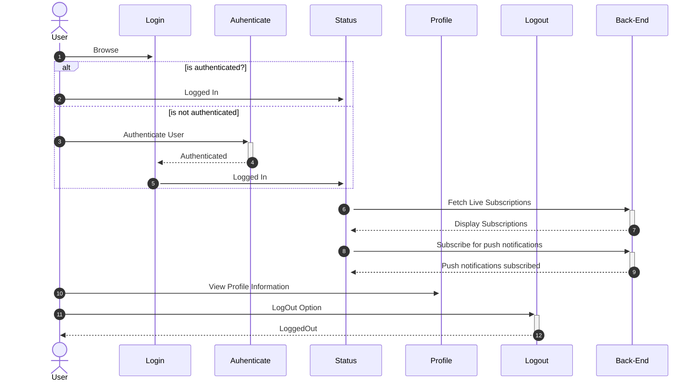

## Microsoft Account Information Application
- A basic progressive web application with front-end and back-end to utilize major concepts of **Angular**, **Serverless** and **Monitoring**
Application display user profile like image, email and name of logged in user defined in `Microsoft Entra ID`
- [Demo](https://fde-msaccprofinfo-dev-001-daa3b0a8bxbdgfc8.z01.azurefd.net)

### Frontend
Built with **Angular** and hosted in `Azure Static Web App` utilize following frameworks and libraries
  - **Angular**
  - **Microsoft Authentication Library** for OAuth
  - **@ngneat/elf** Client Side State Management
  - **Jasmine & Karma** for Unit Testing
  - **TypeScript**
  - **Puppeteer** and **Jest** for Automated UI Test
  - **Playwright** for targetting all the browserrs and using C#. (Comming soon)

### Backend
In order to save browser subscription and send push notification following implementation has been used
  - **Azure Functions** to receieve subscriptions from client and also perform unsubscribe
  - **Azure Cosmos DB** to store subscriptions from PWA
  - **Storage Queue** to add notifications in the queue and Azure Function Trigger to send notification
  - **Azure Monitor** to store all the logs and expception from applications and monitor the applications

### Development Lifecycle
  - **Github Project and Issues** to Store all the tasks and issues
  - **Azure DevOps** for Continuous Integration and Delivery. Only main branch is deployed
  - **Release Annotations** to mark release in Application Insights

