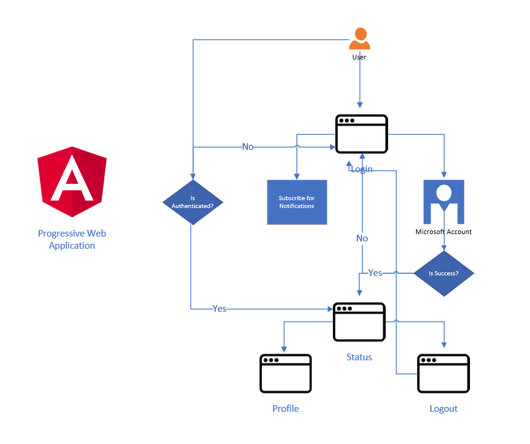
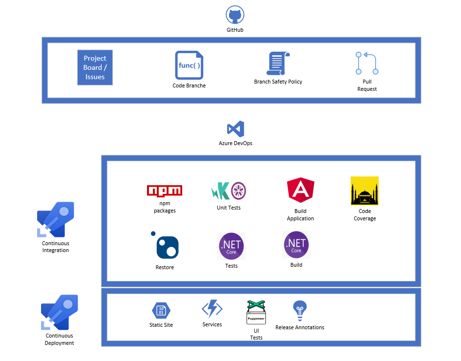

## Microsoft Account Information Application
- A basic progressive web application with front end and backend to utilize major concepts of **Angular**, **Serverless** and **Telemetry**
Application display user profile like image, email and name of Azure AD or personal account
- [Demo](https://ms-profile-information-fd.azurefd.net)

### Frontend
Built with **Angular** and host in **Azure Storage Blob** utilize following concepts and tools
  - **Angular**
  - **Microsoft Authentication Library** for OAuth
  - **Akita** Client Side State Management
  - **Jasmine & Karma** for Unit Testing
  - **TypeScript**
  - **Puppeteer** and **Jest** for Automated UI Test
  

### Backend
In order to save browser subscription and send push notification following tools and concepts utlized
  - **Azure Functions** to receieve subscriptions from client and also perform unsubscribe
  - **Azure Cosmos DB** to store subscriptions from PWA
  - **Storage Queue** to add notifications in the queue and Azure Function Trigger to send notification
  - **Azure Application Insights** to store all the logs and expception from applications

### Development Lifecycle
  - **Github Project and Issues** to Store all the tasks and issues
  - **Azure DevOps** for Continuous Integration and Delivery. Only master branch is deployed
  - **Release Annotations** to mark release in Application Insights

